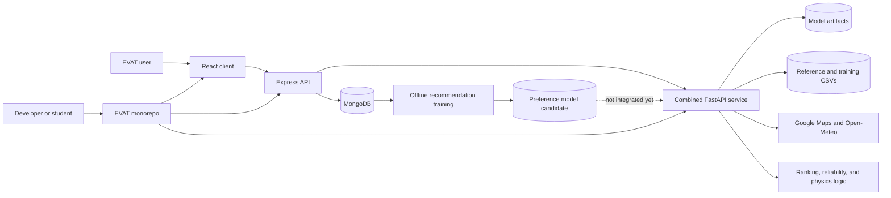
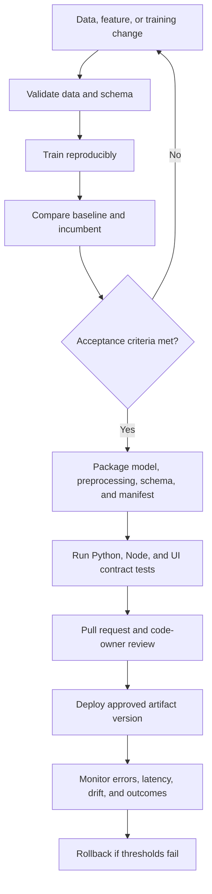

# EVAT Machine Learning Handover Guide

- **Task:** 058S1 — Prepare Machine Learning Handover Documentation
- **Audience:** New EVAT students, developers, data scientists, and maintainers
- **Last verified against:** `main` at `b13c949` (26 August 2026)
- **Operational companion:** [Machine Learning Deployment Guide](MACHINE_LEARNING_DEPLOYMENT_GUIDE.md)
- **Architecture companion:** [051S1 Machine Learning Pipeline Architecture (PR #34)](https://github.com/Chameleon-company/EVAT/pull/34)

## 1. Purpose

This guide is the starting point for anyone inheriting EVAT's machine learning work. It explains where the relevant code and data live, which models are reproducible, how requests reach the models, how to set up and test the project, what can currently be deployed, and which gaps should be addressed next.

EVAT is a monorepo with three runtime layers:

- a Vite and React web client;
- an Express and TypeScript API backed by MongoDB; and
- a combined FastAPI service containing ML models, scoring logic, and physics-based calculations.

The repository does **not** contain one uniform ML lifecycle. Some models are trained from repository data, some are trained every time the Python API starts, some are committed artifacts without their original training code, and some features use deterministic formulas rather than a trained model. New maintainers should preserve those distinctions in code, documentation, and stakeholder communication.

## 2. First-day onboarding path

Use this order to minimize setup time and avoid changing an artifact before its dependencies are understood.

1. Read the root [`README.md`](../README.md) for the full-stack overview.
2. Read this handover guide from start to finish.
3. Read the [Machine Learning Deployment Guide](MACHINE_LEARNING_DEPLOYMENT_GUIDE.md) before running or replacing models.
4. Inspect [`server/python-services/main.py`](../server/python-services/main.py) to see which Python capabilities share one process.
5. Inspect the Node service and route for the capability you will change; the browser normally calls Node, not Python directly.
6. Create local `.env` files from the examples and obtain secrets from an authorized project owner.
7. Install Node and Python dependencies.
8. Run the builds and the relevant automated tests before making a change.
9. Start the services individually first, then run the full stack.
10. Make one narrow change, test the Node-to-Python contract, and document any model or data impact in the pull request.

### Suggested reading by task

| If you are changing... | Read first |
|---|---|
| Python API composition or startup | `server/python-services/main.py`, then the capability module |
| React ML feature | `client/web-app/src/pages/`, the matching client service, Node route/controller/service, then Python |
| Charging recommendations | Node recommendation request builder/history service, Python ranking service, then `training/Readme.md` |
| An existing artifact | This guide's Sections 5, 10, and 12 before loading or replacing it |
| Deployment | The deployment guide, root scripts, CI workflow, and current Dockerfile |
| Dataset or feature schema | Dataset catalogue, producer code, consumer code, and tests |

## 3. Runtime and data-flow orientation



Typical application request:

```text
React page
  -> client service
  -> Node route/controller/service
  -> MongoDB enrichment when required
  -> Python endpoint via PYTHON_API_URL
  -> model, rules, reference data, or external API
  -> Node response and optional persistence
  -> React result
```

Direct Python endpoints have no application authentication. They are intended to sit behind the Node API in the normal application flow. Do not expose the combined Python service publicly without network controls, input limits, observability, and an explicit security review.

## 4. Repository structure

```text
EVAT/
├── README.md                         Project overview and full-stack setup
├── package.json                      Workspace build, test, and dev commands
├── .env.example                     Shared port and client API URL example
├── .github/
│   ├── CODEOWNERS                    Requires evat-reviewers approval
│   └── workflows/pr-build.yml        Node and web build checks
├── client/
│   ├── web-app/                      Active Vite and React web client
│   └── mobile-app/                   Mobile projects; not in the main ML runtime
├── server/
│   ├── node-api/                     Express API, MongoDB access, auth, proxies
│   │   ├── server.ts                 Route mounting and Node startup
│   │   ├── src/routes/               Public application API contracts
│   │   ├── src/controllers/          HTTP validation and response handling
│   │   ├── src/services/             Domain logic and Python calls
│   │   ├── src/repositories/         MongoDB data access
│   │   ├── src/models/               MongoDB and domain models
│   │   ├── test/                     Jest unit and integration tests
│   │   └── Dockerfile                Node-only container definition
│   └── python-services/
│       ├── main.py                   Combined FastAPI entry point
│       ├── requirements.txt          Shared Python runtime dependencies
│       ├── costComparison/           Startup-trained regression selection
│       ├── demandForecasting/        Demand artifact and runtime features
│       ├── environmental_impact_analysis/
│       │                              Notebook-trained emissions model
│       ├── personalisedEVInsights/   K-Prototypes artifact and inference
│       ├── pricePrediction/          Price artifact, schema, and inference
│       ├── charging_station_recommendation_api/
│       │                              Fixed ranker plus offline preference training
│       ├── reliability_scoring_api/  Formula, VADER sentiment, and station CSV
│       └── weatherAwareRouting/       Physics and external routing/weather APIs
└── docs/
    ├── MACHINE_LEARNING_DEPLOYMENT_GUIDE.md
    └── MACHINE_LEARNING_HANDOVER.md
```

### Where to trace a feature

Start at the React page, find its service call, then follow the matching Node route to its controller and service. The Node service reveals the Python endpoint and any MongoDB enrichment. Finally, inspect the endpoint in `server/python-services/main.py` and the imported capability module.

Use `rg` to trace a path quickly:

```bash
rg -n "pricePrediction|price-prediction" client/web-app/src server/node-api/src server/python-services
```

## 5. Capability and trained-model catalogue

| Capability | Type | Training available here? | Active runtime asset or logic | Important status |
|---|---|---:|---|---|
| Charging preference | Logistic regression pipeline | Yes | `preference_model.joblib`, `preference_weights.json` | Candidate artifact is not consumed by the active ranker |
| Cost comparison | Best of Gradient Boosting, Random Forest, Ridge | Yes | Best pipeline held in memory | Trains on every combined-service startup; not persisted |
| Environmental impact | Gradient Boosting regression pipeline | Yes, notebook | `co2_savings_model.pkl` | No holdout evaluation is implemented in the notebook |
| Vehicle price | Serialized fitted pipeline/model | No | `price_best_model_latest.joblib` | Original training and evaluation are missing |
| Charging demand | LightGBM artifact, according to inference code | No | `ev_demand_model.pkl` | Original training and evaluation are missing |
| Personalised insights | K-Prototypes bundle | No | `kproto_bundle.pkl` | Cluster definitions in Node must stay aligned with artifact IDs |
| Charging-station ranking | Fixed weighted scoring | Not applicable | `services/scoring.py` | Active logic is not the preference model |
| Reliability scoring | Fixed formula plus VADER | Not applicable locally | Formula, VADER lexicon, station CSV | VADER is third-party pretrained logic |
| Weather-aware routing | Physics and thresholds | Not applicable | Python formulas and vehicle constants | Depends on Google Maps and Open-Meteo |

### 5.1 Charging preference model

Location: [`server/python-services/charging_station_recommendation_api/training/`](../server/python-services/charging_station_recommendation_api/training/)

The dataset builder reads completed recommendation sessions from MongoDB and produces one row per station candidate. The selected station is labelled `1`; other candidates are labelled `0`. Invalid snapshots, duplicates, missing station IDs, and sessions without exactly one selected candidate are removed.

The model uses numeric imputation and scaling, categorical imputation and one-hot encoding, a session-grouped 75/25 split, and balanced logistic regression. The committed metadata records 35 completed sessions, 326 candidate rows, and initial accuracy, precision, recall, F1, and ROC-AUC metrics.

Outputs:

- `training/model_output/preference_model.joblib` — fitted preprocessing and classifier;
- `training/model_output/preference_weights.json` — coefficients, split information, and metrics.

Serving status: the active recommendation service still uses fixed weights from `services/scoring.py`. Integrating this learned model is future work and requires an explicit feature-contract and rollout decision.

### 5.2 Cost-comparison model

Location: [`server/python-services/costComparison/`](../server/python-services/costComparison/)

`model_runner.load_and_train()` reads `data/dummy_data.csv`, clips values and target outliers, engineers cost and interaction features, makes a fixed 75/25 split, fits three candidate regressors, and selects the highest test R².

The selected model is stored only in Python memory. The combined FastAPI lifespan retrains it on every startup. There is no persisted model, training manifest, or durable metrics file. Run one Python worker until training is separated from serving.

### 5.3 Environmental-impact model

Location: [`server/python-services/environmental_impact_analysis/`](../server/python-services/environmental_impact_analysis/)

`Clean_Model_Code.ipynb` loads five vehicle-consumption datasets, calculates EV and ICE emissions, samples 4,000 EV/ICE pairs, one-hot encodes categorical features, trains Gradient Boosting, and writes `co2_savings_model.pkl`.

The notebook currently fits the full sample without a holdout or cross-validation report. Add evaluation before treating a regenerated artifact as an improvement. `predict.py` loads the artifact for each prediction request.

### 5.4 Vehicle price prediction

Location: [`server/python-services/pricePrediction/`](../server/python-services/pricePrediction/)

The service loads `artifacts/price_best_model_latest.joblib` at startup. It derives the feature contract from the model when possible, otherwise from the committed enriched CSV. Runtime code derives features, loads enrichment defaults, aligns column order, predicts log-price, and applies `expm1` to return a non-negative price.

The repository does not contain the original training pipeline, split, metrics, or artifact manifest. Use `/pricePrediction/schema` and `/pricePrediction/model/info` to inspect the live contract before changing inputs.

### 5.5 Charging demand forecast

Location: [`server/python-services/demandForecasting/`](../server/python-services/demandForecasting/)

The module loads the model, postcode baseline, coordinates, and feature order at import. Prediction combines postcode/state baselines with calendar, Australian holiday, and Open-Meteo temperature features. Weather failure falls back to 20°C. Forecast dates must be in the future and no more than 16 days ahead.

The artifact's training source and evaluation are not committed.

### 5.6 Personalised EV insights

Location: [`server/python-services/personalisedEVInsights/`](../server/python-services/personalisedEVInsights/)

`kproto_bundle.pkl` contains the K-Prototypes model, feature order, and categorical indices. Python coerces and orders questionnaire values, then returns a cluster ID. Node maps that ID to a hard-coded profile description, averages, and savings calculation before persisting the result.

Any replacement bundle must preserve cluster semantics or update the Node mappings in the same change. The original training dataset, cluster selection evidence, and training code are missing.

### 5.7 Deterministic analytical services

Charging ranking, reliability, and weather-aware routing are part of the ML service boundary but are not locally trained models:

- charging ranking uses per-request normalization and fixed factor weights;
- reliability uses operational status, normalized charger power, and configurable weights;
- feedback sentiment uses VADER thresholds;
- weather-aware routing applies vehicle physics, elevation, temperature, headwind, traffic, and air-conditioning factors.

Call these scoring, sentiment, or analytical services rather than claiming they were trained on EVAT data.

## 6. Dataset catalogue

Row counts below exclude the header and describe the current committed snapshots. They are orientation aids, not quality guarantees.

| Dataset | Current rows | Purpose | Producer or source | Regeneration status |
|---|---:|---|---|---|
| `charging_station_recommendation_api/training/training_dataset.csv` | 326 | Candidate-choice classification | `dataset_builder.py` from MongoDB sessions | Reproducible with database access |
| `costComparison/data/dummy_data.csv` | 9,999 | Cost model selection | Not documented | Training code exists; source provenance missing |
| `costComparison/data/test.ev_vehicles.csv` | 58 | EV efficiency lookup | Not documented | No generator recorded |
| `costComparison/data/ice_vehicles.csv` | 55 | ICE efficiency lookup | Not documented | No generator recorded |
| `demandForecasting/postcode_baseline.csv` | 2,533 | Baseline daily demand by postcode | Not documented | No generator recorded |
| `demandForecasting/postcode_coords.csv` | 2,533 | Coordinates for weather lookup | Not documented | No generator recorded |
| `environmental_impact_analysis/Data/*.csv` | 200 each | EV, diesel, and petrol vehicle consumption | Not documented in repository | Consumed by notebook |
| `pricePrediction/artifacts/car_price_enriched_latest.csv` | 2,500 | Schema and enrichment defaults | Not documented | Training source absent |
| `pricePrediction/artifacts/feature_dictionary.csv` | 29 | Price feature descriptions and metadata | Not documented | Manually maintained or externally generated |
| `reliability_scoring_api/data/EVAT-Final-Enriched.csv` | 262 | Station reliability dashboard and lookup | Not documented | No generator recorded |

### Dataset handling rules

- Do not overwrite a committed dataset until its source, licence, collection date, schema, and quality report are recorded.
- Treat MongoDB recommendation sessions as user-linked behavioural data. Remove or hash identifiers where they are not required for grouping.
- Never commit credentials, email addresses, tokens, or private exports.
- Preserve the previous dataset or immutable hash when releasing a replacement model.
- Validate row counts, column names, types, missingness, duplicates, ranges, label distribution, and leakage boundaries.
- Keep feature names and units synchronized between training, artifacts, Python inference, Node payloads, and React forms.
- Avoid using file modification time as dataset provenance; record provenance in a manifest.

## 7. Artifact catalogue and safety

| Artifact | Format | Approximate size | Producer present? | Consumer and load time |
|---|---|---:|---:|---|
| `preference_model.joblib` | Joblib | 5.5 KB | Yes | Not currently loaded |
| `preference_weights.json` | JSON | 1.9 KB | Yes | Not currently loaded |
| `co2_savings_model.pkl` | Joblib/pickle file | 143 KB | Yes, notebook | Environmental prediction, per request |
| `price_best_model_latest.joblib` | Joblib | 295 KB | No | Price API, startup |
| `ev_demand_model.pkl` | Joblib/pickle file | 1.0 MB | No | Demand module, import |
| `kproto_bundle.pkl` | Pickle | 4.9 KB | No | Insights module, import |
| Cost-comparison selected model | Memory only | Not applicable | Yes | Trained during startup |

Pickle and Joblib artifacts can execute code during deserialization. Load only reviewed artifacts from a trusted EVAT source. Never solve an incompatibility by downloading an unverified replacement.

A future artifact manifest should include model name/version, Git commit, dataset hash and provenance, feature schema, target definition, preprocessing, split strategy, random seeds, metrics, dependency versions, artifact checksum, limitations, owner, approval, and rollback version.

## 8. API endpoint handover

### 8.1 Node application endpoints

The Node API normally listens on `http://localhost:8080`. Swagger is available at `/api/docs`, and OpenAPI JSON is at `/api-docs/json`. Unless marked public, endpoints below use JWT user/admin authentication.

| Capability | Method and Node path | Purpose |
|---|---|---|
| Cost prediction | `POST /api/predict/cost` | Predict savings, trip costs, and emissions |
| Cost charts | `POST /api/predict/cost/charts` | Forecast, scenario, importance, and parity data |
| Vehicle lookup | `GET /api/predict/vehicles/ev`, `GET /api/predict/vehicles/ice` | List vehicles used by cost comparison |
| Vehicle efficiency | `POST /api/predict/vehicles/ev/efficiency`, `POST /api/predict/vehicles/ice/efficiency` | Resolve model efficiency |
| Demand forecast | `POST /api/predict/demand` | Forecast postcode charging demand |
| Demand support | `GET /api/predict/demand/postcodes`, `GET /api/predict/demand/coords/:postcode` | List supported postcodes and coordinates |
| Price health | `GET /api/predict/price/health` | Public proxy health check |
| Price schema/model | `GET /api/predict/price/schema`, `GET /api/predict/price/model/info` | Inspect live feature/model contract |
| Price prediction | `POST /api/predict/price`, `POST /api/predict/price/batch` | Single or batch vehicle-price prediction |
| Reliability health | `GET /api/reliability/health` | Public proxy health check |
| Reliability data | `GET /api/reliability/suburbs`, `/summary`, `/stations`, `/stations/:id`, `/top` | Query station reliability data |
| Reliability scoring | `POST /api/reliability/score`, `/score/batch`, `/sentiment` | Score stations or feedback |
| Environmental impact | `POST /api/env-impact-analysis/compare` | Load EV/ICE records and predict savings |
| Personalised insights | `POST /api/personalised-ev-insights/` | Persist questionnaire, predict cluster, save result |
| Latest insight | `GET /api/personalised-ev-insights/latest` | Retrieve current user's latest result |
| Weather-aware route | `POST /api/weather-aware-routing/predict` | Route and energy prediction; route currently has no auth middleware |
| Charging recommendations | `POST /api/charger-recommendations/` | Build, rank, and persist a recommendation session |
| Recommendation selection | `POST /api/charger-recommendations/:sessionId/selection` | Save the user's selected station for future training |

### 8.2 Combined Python endpoints

The Python service normally listens on `http://127.0.0.1:5000`. Swagger is at `/docs` and OpenAPI JSON at `/openapi.json`.

| Capability | Python paths |
|---|---|
| Service root | `GET /` |
| Weather routing | `POST /weatherAwareRouting/predict` |
| Personalised insights | `POST /personalisedEVInsights/predict` |
| Environmental impact | `POST /environmentalImpact/predict` |
| Demand forecasting | `POST /demandForecasting/predict`, `GET /postcodes`, `GET /coords/{postcode}` under `/demandForecasting` |
| Cost comparison | `POST /costComparison/predict`, `/charts`; vehicle lookup and efficiency paths under `/costComparison/vehicles` |
| Price prediction | `GET /pricePrediction/health`, `/schema`, `/model/info`; `POST /predict`, `/predict/batch` under `/pricePrediction` |
| Charging ranking | `POST /charging-station-recommendations/rank` |
| Reliability | `/reliability/health`, `/suburbs`, `/summary`, `/stations`, `/stations/{id}`, `/top`, `/score`, `/score/batch`, `/sentiment` |

When a contract changes, update all layers in one pull request: Python request/response model, Node service and controller, Swagger comments, client service and form, tests, and documentation.

## 9. Environment and local setup

### 9.1 Prerequisites

- Git;
- Node.js 18 or newer; CI currently uses Node 24;
- npm;
- Python 3.11 recommended;
- MongoDB access;
- valid project credentials for Google-backed features; and
- Docker only if reviewing the current Node container or building future deployment support.

### 9.2 Install dependencies

From the repository root:

```bash
npm install
python3 -m venv .venv
source .venv/bin/activate
python -m pip install --upgrade pip setuptools wheel
python -m pip install -r server/python-services/requirements.txt
```

The recommendation training tools additionally require their training requirements, including `pymongo`:

```bash
python -m pip install -r server/python-services/charging_station_recommendation_api/training/requirements.txt
```

Those requirements pin older data-science package versions than the shared runtime file. Prefer a separate training virtual environment when exact reproducibility matters.

### 9.3 Environment files

Create and keep uncommitted:

- `.env` for shared settings;
- `server/node-api/.env` for backend secrets and Google credentials;
- `client/web-app/.env` for browser-exposed `VITE_*` values only.

The current example files are incomplete for the full ML stack. In addition to their placeholders, local development normally needs:

```dotenv
PYTHON_API_URL=http://127.0.0.1:5000
RELIABILITY_API_URL=http://127.0.0.1:5000/reliability
```

`weatherAwareRouting/config.py` explicitly loads `server/node-api/.env`, so a valid `GOOGLE_MAPS_API_KEY` must be available there. The combined Python process currently constructs the Google Maps client during import; a missing key can prevent unrelated Python capabilities from starting.

Never place secrets in client `VITE_*` variables unless they are explicitly safe for browser exposure and restricted accordingly.

## 10. Running and testing

### 10.1 Start services

Activate `.venv`, then start the full stack:

```bash
npm run dev
```

This starts the client, Node API, and combined Python API. Because the root script stops the other processes when one fails, use separate terminals while troubleshooting:

```bash
npm run dev:client
npm run dev:server
npm run dev:python
```

Usual local addresses:

- client: `http://localhost:3000` as configured by the current Vite setup;
- Node API: `http://localhost:8080`;
- Node Swagger: `http://localhost:8080/api/docs`;
- Python API: `http://127.0.0.1:5000`;
- Python Swagger: `http://127.0.0.1:5000/docs`.

If macOS Control Center uses port 5000, start Python on another port and update `PYTHON_API_URL`. The root `dev:python` script hard-codes 5000, so use separate commands in that case.

### 10.2 Build checks

Run the same build commands used by pull-request CI:

```bash
npm run build:server
npm run build:client
```

The current CI workflow installs with `npm ci` and builds both targets. It does not run Jest, Python tests, linting, model smoke tests, or artifact validation.

The current server TypeScript configuration has no `outDir`, so a local server build emits untracked `.js` files beside `server.ts` and the files under `src/`. Check `git status` after building and remove only confirmed generated files; a future change should configure a dedicated ignored build directory. If the client reports a missing module that exists in the lockfile, stop development processes, run `npm ci`, and build again before changing source code.

### 10.3 Node tests

```bash
npm run test:server -- --runInBand
```

The Node suite covers controllers, middleware, repositories, routes, and services, but it is **not currently green on `main`**. On the verification date, 19 of 28 suites and 187 of 208 tests passed. Existing failures include stale controller constructor mocks, outdated token/profile expectations, gamification mocks, a database test that requires `MONGODB_URI`, and a MongoDB Memory Server setup timeout. Record this baseline in pull requests and do not attribute every existing failure to a documentation or ML-only change.

The recommendation-history integration script may require separate MongoDB configuration:

```bash
npm run test:integration:recommendation-history --workspace=server
```

The root defines `test:client`, but the current client package has no `test` script. Treat client testing as a known configuration gap rather than assuming `npm run test:client` works.

### 10.4 Python recommendation tests

Run the currently working ranking units from the repository root:

```bash
PYTHONPATH="$PWD/server/python-services:$PWD/server/python-services/charging_station_recommendation_api" \
  .venv/bin/python -m pytest \
  server/python-services/charging_station_recommendation_api/tests/test_candidate_filters.py \
  server/python-services/charging_station_recommendation_api/tests/test_ranking_service.py
```

The current `tests/test_main.py` expects a standalone FastAPI `app` that `charging_station_recommendation_api/main.py` does not define, so it fails during collection and is intentionally excluded until the wrapper or test is corrected.

Run training helper tests with the training package on `PYTHONPATH`:

```bash
PYTHONPATH="$PWD/server/python-services/charging_station_recommendation_api" \
  .venv/bin/python -m unittest \
  server/python-services/charging_station_recommendation_api/training/test_training_pipeline.py
```

### 10.5 Smoke tests

With the Python service running:

```bash
curl --fail http://127.0.0.1:5000/
curl --fail http://127.0.0.1:5000/pricePrediction/health
curl --fail http://127.0.0.1:5000/reliability/health
```

Use Swagger for representative authenticated Node requests. A useful change-specific test matrix includes:

- expected valid input;
- boundary numeric values;
- missing required fields;
- extra fields;
- unseen categories;
- missing external API response;
- missing artifact/reference data;
- Python unavailable from Node; and
- single and batch requests where supported.

### 10.6 Definition of done for an ML change

- [ ] Dataset and feature changes are documented.
- [ ] Training and inference transformations match.
- [ ] Leakage-safe evaluation is recorded.
- [ ] Model/artifact version and checksum are recorded.
- [ ] Relevant Python and Node tests pass.
- [ ] Both CI build commands pass.
- [ ] Node-to-Python request and failure paths are exercised.
- [ ] Representative UI flow is verified in a browser.
- [ ] Previous artifact and rollback instructions are retained.
- [ ] Deployment and handover docs are updated.

## 11. Deployment and release process

### 11.1 Current supported process

The repository documents local development and a non-reloading local Python process. It does not contain a complete reviewed production deployment for the full ML stack.

For a stable local Python process:

```bash
cd server/python-services
python -m uvicorn main:app --host 127.0.0.1 --port 5000 --workers 1
```

Use one worker because each worker independently trains the cost model and loads its own artifact copies.

### 11.2 Docker status

Only `server/node-api/Dockerfile` exists. There is no Python Dockerfile or Docker Compose file. The Node Dockerfile does not package the React client, MongoDB, Python models, reference datasets, or Python dependencies.

Treat the Dockerfile as a starting point, not a complete EVAT deployment. Review it before production use: it installs production-only dependencies before invoking the TypeScript build even though TypeScript is a development dependency, and it does not define health checks, a non-root user, or multi-stage output.

The deployment guide contains a disposable Python development-container command. A future production design should use a reviewed Python image, pinned dependencies, non-root execution, health checks, explicit artifact versions, secret injection, and a Node/Python network contract.

### 11.3 Model release workflow



For the current repository, do not overwrite a working artifact immediately. Write a candidate filename, test it through a configurable path where supported, record metrics and dependency versions, obtain review, then replace the canonical artifact. Keep the previous approved version available for rollback.

### 11.4 Pull-request expectations

Every path is covered by `.github/CODEOWNERS`, so a member of `@Chameleon-company/evat-reviewers` must approve. A good ML pull request includes:

- task identifier and business reason;
- data source and schema changes;
- model/preprocessing changes;
- before/after metrics on the same evaluation data;
- artifact and dataset checksums;
- commands executed and outcomes;
- API compatibility notes;
- deployment and rollback steps; and
- limitations or follow-up work.

## 12. Common failure modes

| Symptom | Likely cause | First action |
|---|---|---|
| Python fails with Google credentials error | Missing `GOOGLE_MAPS_API_KEY` in `server/node-api/.env` | Configure a valid restricted key and restart |
| Port 5000 already in use | macOS Control Center/AirPlay or another service | Use `lsof`, choose another port, update Node URL |
| Model or CSV not found | Python started from the wrong working directory | Start through root npm script or from `server/python-services` |
| Joblib/pickle load error | Dependency mismatch or damaged/untrusted artifact | Use Python 3.11 and documented dependencies; verify provenance |
| Client build cannot resolve an installed package file | Stale or incomplete `node_modules` | Stop dev processes, run `npm ci`, then rebuild |
| Server build leaves many untracked `.js` files | TypeScript has no dedicated output directory | Confirm they are generated, remove only those files, then add an `outDir` in a separate fix |
| Combined API startup appears slow | Cost candidates train during lifespan | Wait for model R² and selected-model messages |
| Node reports Python connection failure | Python stopped or `PYTHON_API_URL` mismatch | Check Python health and loaded environment |
| Demand forecast rejects date | Date is past or more than 16 days ahead | Use a supported postcode and future date within horizon |
| Recommendation `test_main.py` fails collection | No standalone FastAPI `app` in recommendation module | Run supported units; fix wrapper/test separately |
| `npm run test:client` fails | Client package lacks a test script | Add an agreed client test setup before using root command |
| Full `npm run dev` stops all services | One concurrently managed service exited | Run client, Node, and Python separately to isolate failure |

Do not conceal startup failures with placeholder credentials, untrusted artifacts, or broad exception handling. Preserve the failing input and logs, identify the owning layer, and add a regression test when practical.

## 13. Recommended future improvements

### Priority 0 — reproducibility and service safety

1. Recover or rebuild training pipelines for price, demand, and personalised-insights artifacts.
2. Add model manifests, checksums, dataset provenance, evaluation reports, and rollback versions.
3. Move cost-comparison training out of API startup and load an approved persisted pipeline.
4. Prevent optional weather-routing credentials from blocking unrelated Python capabilities.
5. Separate or isolate capabilities so one import/artifact failure does not stop every ML endpoint.
6. Add a supported full-stack deployment definition for Node, Python, client, and service networking.

### Priority 1 — quality and integration

1. Add leakage-safe evaluation to environmental impact and time-based backtesting to demand forecasting.
2. Decide whether and how the preference model should replace or blend with fixed recommendation weights.
3. Add Python API contract tests, Node proxy integration tests, and browser-level critical-flow tests.
4. Fix the recommendation standalone `test_main.py` contract or remove the unsupported standalone expectation.
5. Add a client test script and include tests/linting in CI.
6. Validate artifact compatibility in CI without requiring production secrets.
7. Add structured startup logs and health/readiness checks for each loaded capability.

### Priority 2 — governance and observability

1. Introduce a versioned artifact registry or immutable release storage instead of ambiguous `latest` filenames.
2. Record model version in every prediction response and persisted result.
3. Monitor latency, errors, feature missingness, unseen categories, drift, and user outcomes.
4. Add dataset cards and model cards covering ownership, licensing, privacy, intended use, and limitations.
5. Define retention and anonymization rules for recommendation-session behavioural data.
6. Schedule periodic evaluation rather than automatic retraining without approval gates.
7. Create capability owners and an escalation path for external API, model, and dataset failures.

## 14. Safe starter tasks for new students

Good first contributions are narrow, testable, and do not replace model artifacts:

- add missing unit tests for feature normalization or request validation;
- improve health/readiness output with model version and artifact checksum;
- add dataset schema validation without changing the dataset;
- fix documentation links or command drift;
- add a client test script and one critical component test;
- isolate the Google Maps client so non-routing imports can start without a key;
- fix the recommendation standalone test/application mismatch; or
- add a model manifest for one existing artifact using verified information only.

Avoid using a first contribution to regenerate all artifacts, change multiple endpoint contracts, upgrade every data-science dependency, or redesign the combined service. Those changes need separate proposals and rollback plans.

## 15. Handover checklist

Before the outgoing team finishes:

- [ ] Repository access and code-owner contacts are confirmed.
- [ ] Local setup works on a clean machine using documented versions.
- [ ] Secrets are transferred through an approved secret manager, never chat or Git.
- [ ] MongoDB database/collection ownership and access are documented.
- [ ] External API projects, billing, quotas, restrictions, and owners are documented.
- [ ] Every dataset has a source, licence, owner, schema, and refresh procedure.
- [ ] Every model has training code or an explicit reproducibility gap.
- [ ] Metrics, limitations, artifact checksums, and rollback versions are recorded.
- [ ] Active Node and Python endpoints are verified.
- [ ] Automated tests and known exclusions are understood.
- [ ] Deployment environment, logs, monitoring, and incident contacts are documented outside secrets.
- [ ] Open ML pull requests and unfinished experiments have owners and next actions.
- [ ] Recommended improvements are prioritized with the incoming team.

Before the incoming team makes its first model change:

- [ ] Baseline builds and tests have been run without source changes.
- [ ] The relevant dataset and feature contract have been traced end to end.
- [ ] The current artifact and metrics have been preserved.
- [ ] Acceptance criteria and rollback conditions have been agreed.
- [ ] The change is isolated on a task branch and reviewed by code owners.

## 16. Quick command reference

```bash
# Node and Python dependencies
npm install
source .venv/bin/activate
python -m pip install -r server/python-services/requirements.txt

# Run independently
npm run dev:client
npm run dev:server
npm run dev:python

# Build as CI does
npm run build:server
npm run build:client

# Node tests
npm run test:server -- --runInBand

# Python service health
curl --fail http://127.0.0.1:5000/
curl --fail http://127.0.0.1:5000/pricePrediction/health
curl --fail http://127.0.0.1:5000/reliability/health

# Inspect ownership and changes
git status --short --branch
git diff --check
```

The project should be handed over as a reproducible system, not only as source files. If a future developer cannot identify the data, rebuild or safely load the model, verify its quality, trace its API contract, deploy it, and roll it back, the handover is not complete.
