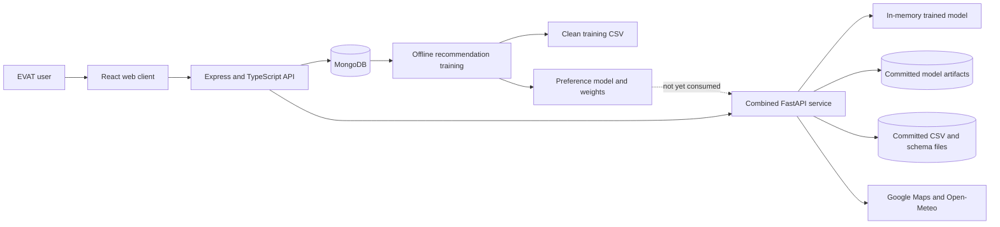
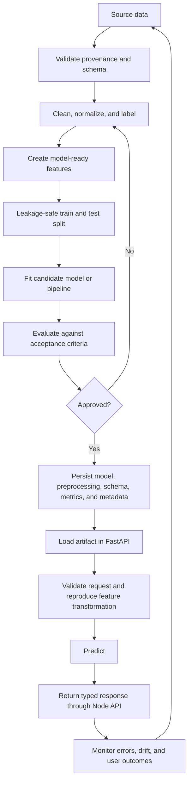
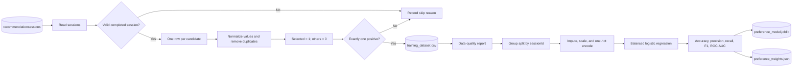
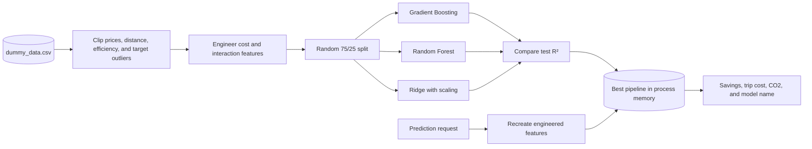
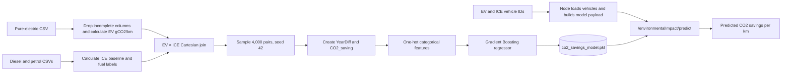
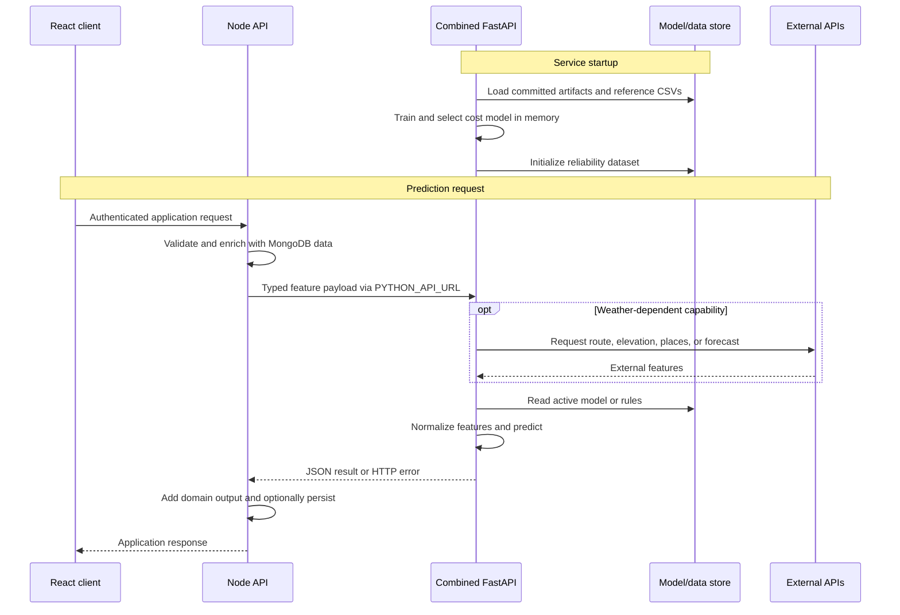
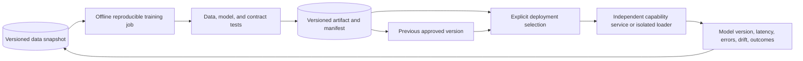

# EVAT Machine Learning Pipeline Architecture

**Task:** 058S1 — Prepare Machine Learning Handover Documentation<br>
**Audience:** Future EVAT developers, data scientists, reviewers, and maintainers<br>
**Last verified against:** `main` at `b13c949` (26 August 2026)<br>
**Related operations guide:** [Machine Learning Deployment Guide](MACHINE_LEARNING_DEPLOYMENT_GUIDE.md)

## 1. Purpose and scope

This document describes how EVAT data moves from source datasets through preparation, training, evaluation, artifact storage, service startup, and prediction. It is intended to let a new maintainer understand the current architecture without first reverse-engineering every Python and TypeScript module.

EVAT does not use one uniform ML pipeline. The repository currently contains four distinct patterns:

1. a reproducible offline training pipeline that writes versionable artifacts;
2. a model-selection pipeline that trains into memory whenever the API starts;
3. committed inference artifacts whose original training pipelines are absent; and
4. deterministic scoring and physics calculations that are ML-adjacent but do not train a model.

That distinction is important. A `.pkl` or `.joblib` file proves that an artifact exists; it does not prove that the repository can reproduce it.

## 2. System context



The normal request path is:

```text
React client -> Node API -> combined Python API -> model/rules -> Node API -> React client
```

The combined Python entry point is [`server/python-services/main.py`](../server/python-services/main.py). It mounts the prediction routes and performs startup initialization. The Node API uses `PYTHON_API_URL` to proxy ML requests and adds application data, authentication, and persistence where required.

## 3. Pipeline inventory

| Capability | Dataset or live inputs | Preparation | Training or algorithm | Evaluation | Stored output | Runtime status |
|---|---|---|---|---|---|---|
| Charging preference model | MongoDB `EVAT.recommendationsessions` | Session validation, candidate flattening, cleaning, labelling, CSV export | Class-balanced logistic regression with grouped split | Accuracy, precision, recall, F1, ROC-AUC | `preference_model.joblib` and `preference_weights.json` | Trained artifact exists but is **not yet used** by ranking |
| Cost comparison | `costComparison/data/dummy_data.csv` | Clipping and engineered cost features | Selects best of Gradient Boosting, Random Forest, and Ridge at service startup | Holdout R² | Memory only | Used by `/costComparison/*` until process restart |
| Environmental impact | Five committed vehicle-consumption CSVs | Column cleanup, emissions calculations, EV/ICE Cartesian sample, one-hot encoding | Gradient Boosting regressor in notebook | No holdout evaluation implemented | `co2_savings_model.pkl` | Loaded on each environmental prediction |
| Vehicle price prediction | Committed enriched CSV, feature dictionary, and model artifact | Runtime derivation, schema alignment, defaults, numeric coercion | Training pipeline not present | Training metrics not present | `price_best_model_latest.joblib` | Loaded once during FastAPI startup |
| Charging demand forecast | Postcode baseline, coordinates, feature list, model artifact, live weather | Runtime postcode/date/weather feature assembly | Training pipeline not present; artifact is identified as LightGBM in code | Training metrics not present | `ev_demand_model.pkl` | Loaded when the module is imported |
| Personalised EV insights | User questionnaire and K-Prototypes bundle | Runtime type coercion and feature ordering | Training pipeline not present | Training metrics not present | `kproto_bundle.pkl` | Loaded when the module is imported |
| Charging-station ranking | Enriched candidate list from Node | Eligibility filtering and per-request normalization | Fixed weighted formula | Unit tests; no learned-model metric | Source-code weights | Active; does not consume the preference artifact |
| Reliability scoring | Station CSV or API inputs | Status normalization, power normalization, VADER text preparation | Fixed formula plus pretrained VADER lexicon | Rule checks; no model training | CSV plus source-code/config weights | Active under `/reliability` |
| Weather-aware routing | Route, elevation, traffic, weather, and vehicle constants | Segment construction and unit conversion | Physics calculation and thresholds | No trained-model evaluation | Source-code constants | Active; not a trained ML model |

## 4. Common lifecycle

Each trainable EVAT capability should be understood as the following lifecycle, even where the current implementation covers only part of it:



The current recommendation preference pipeline comes closest to this lifecycle. The artifact-only services begin at artifact loading because their dataset preparation, training, and evaluation stages are not available in this repository.

## 5. Charging preference model pipeline

This is the most complete conventional training workflow in EVAT. Its code lives in [`charging_station_recommendation_api/training/`](../server/python-services/charging_station_recommendation_api/training/).

### 5.1 Data source and label creation

[`dataset_builder.py`](../server/python-services/charging_station_recommendation_api/training/dataset_builder.py) reads recommendation sessions from MongoDB:

```text
Database:   EVAT
Collection: recommendationsessions
```

Each completed recommendation session becomes a group. Each candidate station within that session becomes one row:

- the selected station is labelled `selected = 1`;
- all other candidates are labelled `selected = 0`;
- a valid session must contain exactly one positive row.

The builder excludes sessions with no selection, no candidates, a selected station that is absent from the candidate snapshot, or an entirely zero/missing core snapshot. It removes candidates with no station ID and de-duplicates stations within each session. Text values are normalized, `payAtLocation` becomes `yes`, `no`, or `unknown`, and numeric values remain missing when they cannot be parsed rather than being silently converted to zero.



### 5.2 Features and preprocessing

[`preprocessing.py`](../server/python-services/charging_station_recommendation_api/training/preprocessing.py) defines the v1 feature contract.

Numeric features:

- `distanceKm`
- `durationMin`
- `durationInTrafficMin`
- `energyNeededKwh`
- `chargingPoints`
- `temperatureC`
- `windSpeedMs`

Numeric values use median imputation followed by standard scaling.

Categorical features:

- `roadTrafficCondition`
- `payAtLocation`
- `operator`

Categorical values use most-frequent imputation and one-hot encoding with `handle_unknown="ignore"`.

`cost` is excluded because most collected rows lack it. `congestionLevel` is excluded because the current training data contains no useful variation. These fields should only be restored after data coverage and variability are re-measured.

### 5.3 Split, training, and evaluation

[`train_preference_model.py`](../server/python-services/charging_station_recommendation_api/training/train_preference_model.py) requires at least 30 completed sessions. It uses `GroupShuffleSplit(test_size=0.25, random_state=42)` with `sessionId` as the group, preventing candidates from the same recommendation event from leaking across train and test sets.

The classifier is logistic regression with:

```text
class_weight = balanced
max_iter     = 2000
random_state = 42
```

The committed v1 metadata reports 35 sessions and 326 candidate rows. Its holdout metrics are:

| Metric | Value |
|---|---:|
| Accuracy | 0.8256 |
| Precision | 0.3636 |
| Recall | 0.8889 |
| F1 | 0.5161 |
| ROC-AUC | 0.8456 |

These results demonstrate that the pipeline works, but 35 positive selections are too few to establish production-grade generalization. The grouped split is correct for leakage control, while the small test set makes the reported metrics sensitive to individual sessions.

### 5.4 Artifact storage and serving status

Training writes:

- [`model_output/preference_model.joblib`](../server/python-services/charging_station_recommendation_api/training/model_output/preference_model.joblib), containing preprocessing and classification;
- [`model_output/preference_weights.json`](../server/python-services/charging_station_recommendation_api/training/model_output/preference_weights.json), containing metrics, split metadata, intercept, and transformed-feature coefficients.

The active recommendation service does **not** load either artifact. [`services/scoring.py`](../server/python-services/charging_station_recommendation_api/services/scoring.py) still ranks candidates using fixed source-code weights. The learned model is therefore a candidate artifact awaiting explicit integration, compatibility tests, and a rollout decision.

### 5.5 Rebuild commands

From the repository root, with the Python environment active and `MONGODB_URI` configured:

```bash
python -m pip install -r server/python-services/charging_station_recommendation_api/training/requirements.txt
cd server/python-services/charging_station_recommendation_api/training
python dataset_builder.py
python data_quality_check.py
python train_preference_model.py
cd ..
python -m unittest training/test_training_pipeline.py
```

Review the generated CSV diff, metrics, and coefficient changes before committing either artifact.

## 6. Cost-comparison startup-training pipeline

[`costComparison/model_runner.py`](../server/python-services/costComparison/model_runner.py) is a runtime training and model-selection pipeline.



Preparation includes input clipping, target clipping to the 1st–99th percentiles, and the following engineered features:

- fuel cost per kilometre;
- EV cost per kilometre;
- distance × petrol price;
- distance × electricity price; and
- ICE-to-EV efficiency ratio.

The candidates are Gradient Boosting, Random Forest, and Ridge. A fixed 75/25 random split (`random_state=42`) is used, and the candidate with the highest test R² becomes the active model.

The combined FastAPI lifespan calls `load_and_train(...)` every time the service starts. The selected model and test data are held only in module globals; no model file, metric report, dataset hash, or training manifest is written. Consequently:

- every worker trains its own model;
- restarting retrains the model;
- the committed CSV determines the result;
- production promotion and rollback are not artifact-based; and
- the printed R² values are the only current evaluation record.

For a durable pipeline, move training out of application startup and store an approved fitted pipeline plus metadata. Until then, use one Python worker and treat changes to the CSV or training code as deployment changes.

## 7. Environmental-impact pipeline

The reproducible source is [`Clean_Model_Code.ipynb`](../server/python-services/environmental_impact_analysis/Clean_Model_Code.ipynb).



EV emissions are calculated from energy consumption using a fixed `0.18 kg/kWh` factor. ICE baselines use `23.2` for petrol and `26.5` for diesel multiplied by combined fuel consumption. The target is `ICE_CO2_Baseline - EV_gCO2_per_km`.

The model features are EV make, ICE make, EV body style, ICE body style, ICE fuel type, model-year difference, and ICE CO2 baseline. Five categorical fields are one-hot encoded, unknown categories are ignored, and a Gradient Boosting regressor is fitted.

The notebook fits all sampled rows and does not currently create a holdout set, cross-validation result, or evaluation report. This is a material gap: a newly generated artifact must not be considered improved merely because training completes.

[`predict.py`](../server/python-services/environmental_impact_analysis/predict.py) loads `co2_savings_model.pkl` for each prediction call. The Node environmental service loads the requested EV and ICE records from MongoDB, validates vehicle types, derives the seven model fields, calls the Python endpoint, and combines the prediction with annual database values.

## 8. Artifact-only inference pipelines

The following services can make predictions but cannot currently reproduce their committed model from source.

### 8.1 Vehicle price prediction

At FastAPI startup, [`price_prediction_api.py`](../server/python-services/pricePrediction/price_prediction_api.py) loads `artifacts/price_best_model_latest.joblib`. It derives the expected feature schema from the fitted model when possible, falling back to the enriched CSV. It also loads feature descriptions, defaults, mileage bins, engine-size bins, and brand/model/fuel medians from committed reference data.

For each request it:

1. keeps recognized features;
2. optionally derives engineered values and enrichment defaults;
3. reports missing, extra, and derived fields;
4. reorders columns to the fitted schema;
5. coerces numeric columns;
6. predicts log-price; and
7. applies `expm1`, bounded at zero, to return the price.

The `/pricePrediction/schema` and `/pricePrediction/model/info` endpoints expose runtime contract information. No training script, split strategy, training metrics, or artifact provenance manifest is committed.

### 8.2 Charging demand forecast

[`demandForecasting.py`](../server/python-services/demandForecasting/demandForecasting.py) loads:

- `ev_demand_model.pkl`;
- `postcode_baseline.csv`;
- `postcode_coords.csv`; and
- `feature_columns.txt`.

At prediction time, it validates the postcode and forecast horizon, requests mean temperature from Open-Meteo, and falls back to 20°C if weather retrieval fails. It builds postcode, state, baseline demand, calendar, holiday, and temperature features, enforces the stored feature order, and calls the model.

The code identifies the artifact as LightGBM, but the training dataset construction, fitting code, split method, evaluation results, and release metadata are not present.

### 8.3 Personalised EV insights

[`personalisedEVInsights.py`](../server/python-services/personalisedEVInsights/personalisedEVInsights.py) loads `kproto_bundle.pkl` at import. The bundle supplies the K-Prototypes model, ordered feature names, and categorical column indices.

Incoming questionnaire values are converted into a DataFrame, missing numeric fields become `0.0`, missing categorical fields become empty strings, and columns are reordered to the bundle schema. The predicted cluster is returned to Node, where hard-coded cluster descriptions, comparison averages, and savings rules are applied and persisted to MongoDB.

The bundle's original dataset, preprocessing/training source, cluster-selection method, validation results, and artifact version metadata are absent. The Node cluster descriptions must remain synchronized with the meanings of cluster IDs in any replacement bundle.

## 9. Deterministic analytical services

These components participate in the prediction architecture but should not be described as locally trained models.

### Charging-station ranking

The active ranker filters ineligible candidates, normalizes candidate-relative measurements, applies fixed weights, sorts by score, and generates reasons. Candidate-relative normalization means a station's score can change when the comparison set changes. The preference model outputs described in Section 5 are not connected to this path.

### Reliability scoring

Reliability is a configurable weighted formula:

```text
reliability = status_score × 0.6 + power_score × 0.4
```

Feedback sentiment uses VADER compound scores with positive and negative thresholds of `+0.2` and `-0.2`. VADER is a third-party pretrained lexicon/rule system; EVAT does not train it.

### Weather-aware routing

Weather-aware routing combines Google Directions, Elevation, and Places data with Open-Meteo conditions. Segment energy is calculated from rolling resistance, aerodynamic drag, gradient, auxiliary power, temperature, and headwind. Traffic and air-conditioning multipliers adjust the result. These are physical formulas and engineering thresholds, not a learned estimator.

## 10. Runtime startup and prediction sequence



The Python process currently fails during import if `GOOGLE_MAPS_API_KEY` is missing because the weather-routing Google client is constructed at module load time. One unavailable optional capability can therefore prevent all combined ML routes from starting.

## 11. Artifact storage and release contract

Current artifact locations are:

| Artifact | Producer in repository | Consumer | Load time |
|---|---|---|---|
| `charging_station_recommendation_api/training/model_output/preference_model.joblib` | `train_preference_model.py` | None currently | Not loaded |
| `charging_station_recommendation_api/training/model_output/preference_weights.json` | `train_preference_model.py` | None currently | Not loaded |
| `environmental_impact_analysis/co2_savings_model.pkl` | `Clean_Model_Code.ipynb` | `predict.py` | Per request |
| `pricePrediction/artifacts/price_best_model_latest.joblib` | Not present | Price API | FastAPI startup |
| `demandForecasting/ev_demand_model.pkl` | Not present | Demand module | Module import |
| `personalisedEVInsights/kproto_bundle.pkl` | Not present | Insights module | Module import |
| Cost-comparison selected pipeline | `model_runner.load_and_train` | Cost API | Trained at startup; memory only |

Pickle and Joblib files can execute Python code while loading. Only load reviewed artifacts from trusted EVAT sources.

Every future persisted model release should be accompanied by a machine-readable manifest containing at least:

- model name and semantic version;
- Git commit and training-code path;
- dataset identity, source, licence, date range, and immutable hash;
- target definition and feature schema in exact order;
- preprocessing steps and fitted preprocessing state;
- split strategy, random seeds, and leakage controls;
- evaluation metrics and acceptance thresholds;
- Python and library versions;
- artifact checksum and creation timestamp;
- known limitations, subgroup checks, and rollback artifact; and
- owner and approval record.

A model, its preprocessing, and its schema should be stored as one fitted pipeline where possible. Never update an artifact without updating its manifest and running contract tests.

## 12. Evaluation and promotion expectations

Before promoting any replacement model:

1. validate schema, ranges, missingness, duplicates, label correctness, and data provenance;
2. split at the correct real-world boundary, such as user or recommendation session, to prevent leakage;
3. compare against the current artifact and a simple baseline on the same untouched test set;
4. report metrics appropriate to the problem rather than accuracy alone;
5. inspect failure cases and important cohorts;
6. test serialization and loading in a clean Python environment;
7. verify single and batch API contracts with representative, missing, extra, and unseen-category inputs;
8. test Node-to-Python integration;
9. preserve the previous artifact for rollback; and
10. record the release in the model manifest.

Recommended core metrics are:

| Problem | Primary metrics | Additional checks |
|---|---|---|
| Imbalanced binary choice | Precision, recall, F1, PR-AUC, ROC-AUC | Per-session ranking quality and calibration |
| Regression | MAE, RMSE, R² | Residual plots, outliers, domain slices |
| Forecasting | MAE/RMSE by horizon | Time-based backtest and seasonal slices |
| Clustering | Stability and silhouette where meaningful | Human interpretation and cluster-size drift |
| Ranking | NDCG@k, MRR, hit rate | Offline replay and online selection rate |

## 13. Known gaps and recommended target architecture

Current high-priority gaps are:

- three inference artifacts have no reproducible training source or evaluation history;
- the environmental pipeline trains without a holdout evaluation;
- cost comparison trains during service startup and does not persist an approved artifact;
- the learned charging-preference model is not integrated into runtime ranking;
- model artifacts lack uniform manifests, checksums, versioning, and rollback conventions;
- automated drift, prediction-quality, and model-version monitoring is absent; and
- a missing routing credential can prevent unrelated ML capabilities from starting.

The preferred evolution is:



This separates training from serving, makes deployments repeatable, prevents one model from blocking unrelated capabilities, and provides an auditable rollback path.

## 14. Handover checklist

When changing an EVAT ML pipeline, confirm that:

- [ ] the data source, licence, date range, and owner are recorded;
- [ ] raw data is preserved or referenced immutably;
- [ ] cleaning and label rules are covered by tests;
- [ ] train/test boundaries prevent leakage;
- [ ] features and transformations match runtime inference exactly;
- [ ] metrics are compared with both the incumbent model and a baseline;
- [ ] the model, preprocessing, schema, and manifest are versioned together;
- [ ] artifacts load in a clean supported environment;
- [ ] API schema and Node proxy tests pass;
- [ ] secrets and personal data are excluded from artifacts and Git;
- [ ] the previous artifact can be restored quickly; and
- [ ] this architecture document and the deployment guide remain accurate.
